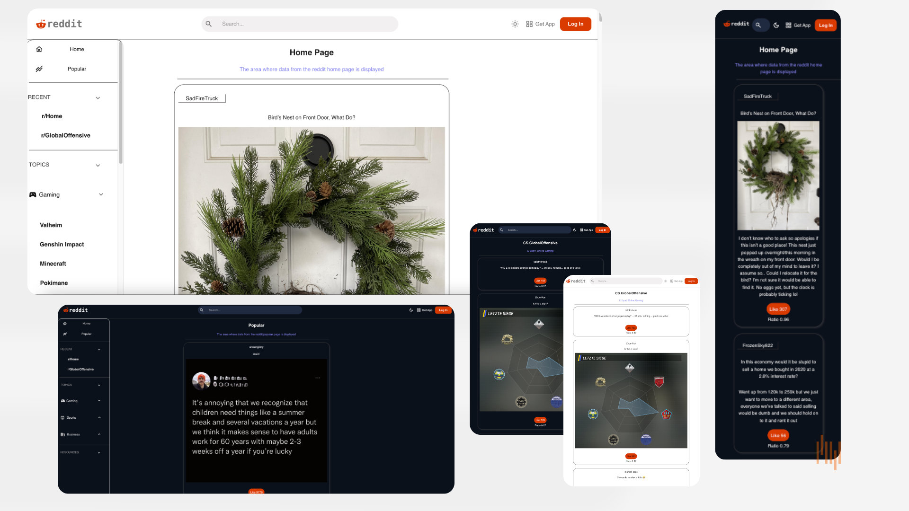

# Reddit-Client Project

In this project, I created a reddit client page with api's pulled from reddit. 

- Packages Used
 - React-Router-Dom
 - Material UI
 - Material UI Icons
 - ProSideBars

 https://reddit-client-project.vercel.app/

 

